# ws-a3-autocon4

**Transforming Network Engineers to Automation Practitioners with MCP**

## Workshop Overview

Welcome to **WS:A3** at the Network Automation Forum AutoCon4! 

This hands-on workshop will transform your approach to network operations by leveraging the revolutionary **Model Context Protocol (MCP)** framework with AI assistance. You'll work with live HPE Juniper Networks virtual topologies running JunOS to develop intelligent automation capabilities that eliminate traditional UI-driven operations.

### Workshop Details

- **Event**: Network Automation Forum - AutoCon4
- **Title**: Transforming Network Engineers to Automation Practitioners w/ MCP
- **Proctors**: Jose Miguel Izquierdo, Jessica Garrison, Nilesh Simaria
- **Organization**: Juniper Networks (now Hewlett Packard Enterprise - HPE)
- **Levels**: 
  - Networking: Intermediate
  - Systems/Linux: Intermediate  
  - Programming: Intermediate

## Learning Objectives

By the end of this workshop, you will be able to:

- **Understand MCP Fundamentals**: Understand the architecture and capabilities of the Model Context Protocol
- **Implement AI-Assisted Configuration Management**: Deploy and Audit network device configurations
- **Develop Automated Testing & Verification**: Create smart validation workflows
- **Perform AI-Powered Root Cause Analysis**: Leverage AI for troubleshooting and diagnostics
- **Simulate Network Resilience**: Test failure scenarios and recovery procedures

## Workshop Agenda

### 🏗️ **MCP Fundamentals**
- Architecture and capabilities overview
- Setting up MCP with Claude Desktop
- Understanding the AI-network automation interface

### ⚙️ **Configuration Management through AI-Assisted Automation**
- Intelligent device discovery and topology mapping
- Dynamic configuration generation and deployment
- Template-based automation with Jinja2

### 🧪 **Automated Testing and Verification**
- Protocol state validation
- Network connectivity testing
- Performance verification workflows

### 🔍 **AI-Powered Root Cause Analysis (RCA) and Troubleshooting**
- Configuration blame analysis
- Core dump investigation
- Intelligent fault diagnosis

### 💥 **Failure Simulation Scenarios**
- Network resilience testing
- Recovery automation
- Health assessment workflows

## Workshop Structure

Each use case in this workshop follows a consistent structure to help you navigate and complete the exercises efficiently. 

- Every use case directory contains a `README.md` file with detailed instructions, objectives, and step-by-step guidance.  
- The workspace includes all necessary configuration files, templates, report examples and resources needed to complete the exercises.
- Each use case is independent from the others and can be executed in any order. It is recommended to follow the instructions of the workshop proctors.
- You'll also find a accomplishments list to track your progress as you work through each task.

This standardized scaffolding ensures you can focus on learning the concepts rather than searching for materials.

### Use cases

This is the list of use cases to be done in this workshop:

- [Use case #1](uc1-lldp/README.md) - LLDP protocol and topology
- [Use case #2](uc2-ifs-desc/README.md) - Interfaces description audit
- [Use case #3](uc3-ospf/README.md) - OSPF - Core dumps analysis
- [Use case #4](uc4-isis/README.md) - ISIS - Config blame
- [Use case #5](uc5-j2/README.md) - Jinja2 template configuration
- [Use case #6](uc6-l3vpn/README.md) - L3VPN troubleshooting
- [Use case #7](uc7-jvd/README.md) - JVD topology
- [Use case #8](uc8-health/README.md) - Network health assessment

These **8 use cases** are located in different folders inside `/home/claude/workspace/`. Each of them is designed to understand different ways of how agentic AI can assist you on your daily tasks as a network engineer:

### 🔗 **UC1 - LLDP (Link Layer Discovery Protocol)**
- **Focus**: Network Discovery & Topology Mapping
- **Skills**: Device configuration, neighbor relationships, topology visualization
- **AI Tasks**: Automated LLDP configuration, neighbor analysis, interactive topology diagrams
- **Goal**: Deploy and configure LLDP across all network devices, then configure the interfaces descriptions aligned with the data gathered from the LLDP protocol and generate an interactive topology diagram that should match the topology defined in Container Lab.

### 📝 **UC2 - Interface Descriptions**
- **Focus**: Smart Configuration Management
- **Skills**: Context-aware configuration, automated doc generation
- **AI Tasks**: Dynamic interface description generation, configuration audit
- **Goal**: Audit configured interface descriptions based on discovered network connections (matching naming convention and real physical links), creating self-documenting network infrastructure that accurately reflects the physical topology

### 🛡️ **UC3 - OSPF & Core Dump Analysis**
- **Focus**: Network Health Assessment & Troubleshooting
- **Skills**: Protocol analysis, crash investigation, health monitoring
- **AI Tasks**: OSPF state validation, core dump forensics, root cause analysis
- **Goal**: Investigate a simulated network failure scenario by analyzing OSPF protocol health and performing forensic analysis of core dump files to determine root cause

### 🔀 **UC4 - ISIS & Configuration Blame**
- **Focus**: Change Attribution & Configuration Forensics
- **Skills**: Change tracking, configuration auditing, blame analysis
- **AI Tasks**: Systematic configuration change attribution, commit history analysis and timeline reconstruction
- **Goal**: Implement comprehensive configuration change tracking by creating a **git blame** equivalent for network device configurations, attributing every configuration line to its author and commit

### 📋 **UC5 - Jinja2 Templates**
- **Focus**: Template-Based Automation
- **Skills**: Dynamic configuration generation, template management
- **AI Tasks**: Template rendering, dry-run and configuration deployment
- **Goal**: Design and deploy standardized network configurations using Jinja2 templates, enabling scalable and consistent device provisioning across the entire topology

### 🌐 **UC6 - L3VPN Troubleshooting**
- **Focus**: Troubleshooting L3VPN service
- **Skills**: Complex service configuration, multi-device orchestration
- **AI Tasks**: End-to-end VPN troubleshooting, service validation, topology awareness, service provisioning.
- **Goal**: Orchestrate complete L3VPN service deployment across multiple PE routers, including automatic route target assignment, VRF configuration, and end-to-end connectivity validation

### 🏗️ **UC7 - Juniper Validated Design (JVD)**
- **Focus**: Architectural Best Practices
- **Skills**: Design pattern implementation, standards compliance
- **AI Tasks**: Design validation, architectural analysis, compliance checking
- **Goal**: Validate network architecture against Juniper Validated Design principles and automatically implement recommended configuration patterns for optimal performance and reliability

### 📊 **UC8 - Network Health Assessment**
- **Focus**: Comprehensive Network Monitoring & Documentation-Driven Operations
- **Skills**: Multi-layer health checking, performance analysis, documentation-driven automation, health policy definition
- **AI Tasks**: Holistic network assessment, predictive analysis, alerting, compliance validation against custom health policies
- **Goal**: Create a custom `NETWORK.HEALTH.md` methodology document defining your network health criteria, then have the AI agent validate and maintain network compliance according to your documented standards

<!--
### 🔒 **UC9 - cSRX Security** (//TODO)
- **Focus**: Security Policy Automation
- **Skills**: Security configuration, policy management
- **AI Tasks**: Intelligent security policy deployment, compliance validation
- **Goal**: Deploy comprehensive security policies across cSRX firewalls, including zone-based configurations, security rules, and automated compliance verification against security best practices
-->

## Technology Stack

### **Network Infrastructure**
- **HPE Juniper Networks cRPD**: Containerized routing protocol daemon
- **JunOS**: Industry-leading network operating system (limited to cRDP)
- **JVDs**: Juniper Validated Designs
- **Container Lab**: Network topology orchestration
- **Docker**: Containerization platform

### **Automation & AI**
- **Model Context Protocol (MCP)**: Revolutionary AI-network interface
- **Claude Desktop Application**: AI assistant with network automation capabilities
- **LLM model**: Sonnet 4.5 
- **Jinja2**: Advanced templating engine
- **Python**: Automation scripting

### **Protocols & Technologies**
- **LLDP**: Network discovery and topology mapping
- **OSPF/ISIS**: Interior gateway protocols
- **BGP L3VPN**: Service provider technologies
- **SSH/NETCONF**: Network management protocols

## Prerequisites

### **Networking Knowledge**
- Understanding of TCP/IP fundamentals
- Familiarity with routing protocols (OSPF, ISIS, BGP)
- Basic knowledge of network topologies and design

### **Systems/Linux**
- Command line navigation and file operations
- Basic understanding of [Docker](https://www.docker.com/ ) and [ContainerLab](https://containerlab.dev/)
- Comfort with SSH and remote system access

### **Programming**
- Basic Python scripting concepts
- Understanding of jinja2 templates `*.j2` and variables `{{ }}`
- Familiarity with JSON/YAML data formats (`*.yaml` or `*.yml`)

## Workshop Environment

### **Lab Infrastructure**
- Pre-configured Linux VM with **Docker**, **ContainerLab**, **Python3** and **uv**
- Multiple JunOS cRPD instances per use case
- Persistent workspace at `/home/claude/workspace/`
- Integrated AI assistant with MCP connectivity

### **Access Requirements**
- Claude Desktop application installed in your laptop
- Claude PRO plan ($20 (1 month)). See Claude [pricing](https://www.claude.com/pricing)
- SSH access to workshop environment (.ssh/config)
- Visual Studio Code (recommended) with the following extensions (last 4 you will need to install them in the remote VM once you have the session open on it):
    - Remote SSH extension
    - ContainerLab extension
    - Markdown Preview Enhanced (recommended)
    - Markdown All in One (recommended)
    - Auto-Open Markdown Preview (recommended)

Here you can find a screenshot with all the extensions and their icons to help you install them:

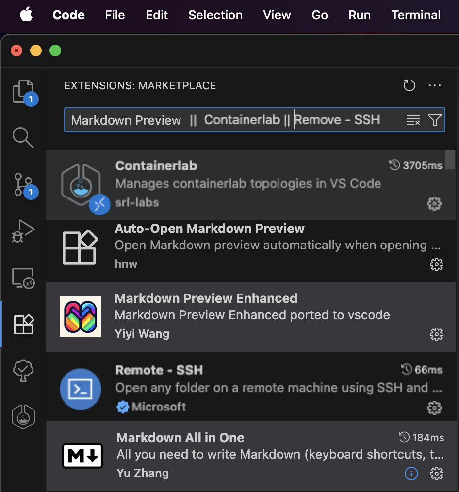

- Web browser for topology visualization
- Terminal/command line access (SSH) (recommended character encoding system: **UTF-8**)

## Getting Started

You should have received an **e-mail** with the details of the workshop (if not, ask the workshop support team). It should have included the following details related to the workshop:

- Repository link
- VM details
  - ${PROVIDED_VM_IP}
  - ${PROVIDED_VM_PORT} (if nothing provided, port is default SSH port (e.g. 22))
- private SSH key (`id_rsa_claude`)

You need to keep all these for you and not share them with anyone else (only  workshop support team if needed).

You might have already done a few of these steps. If so, feel free to follow up and skip the ones you have already done.

### Configure your SSH config files

Before starting the workshop, you must configure your `SSH client` for seamless access to all workshop components:

#### 1. Workshop VM SSH Access

To access the workshop VM, you'll need to configure SSH authentication using the **SSH private key** provided via email (`id_rsa_claude`) or you can also find a copy of it in the [utils/](./utils/) folder of this repo (e.g. `utils/id_rsa_claude`).

1. **Save** the private key file to a secure location on your local machine (e.g. `~/.ssh/id_rsa_claude`). 

2. **Ensure** the key has the correct permissions **600** to prevent SSH from rejecting it due to overly permissive access rights. 

    ```bash
    chmod 600 ~/.ssh/id_rsa_claude
    ```

3. **Test** your connection to the VM using the following command:

    ```bash
	ssh -i ~/.ssh/id_rsa_claude claude@${PROVIDED_VM_IP} -p ${PROVIDED_VM_PORT}
	```

	or remember, if ${PROVIDED_VM_PORT} was not provided, no need to add default port 22 (skipping -p option)

    ```bash
	ssh -i ~/.ssh/id_rsa_claude claude@${PROVIDED_VM_IP}
	```

	replacing `${PROVIDED_VM_IP}` with the VM's IP address and `${PROVIDED_VM_PORT}` with the VM's port provided in the e-mail. The public SSH RSA key (`~/.ssh/id_rsa_claude.pub`) was already added to the user `claude` at the workshop VM and the cRPD devices (`~/.ssh/authorized_keys`) so you can SSH into the workshop VM and the cRPD devices without being asked for the password.
	
4. For convenience, add below code to your `~/.ssh/config` file. This will allow you to connect to the workshop VM simply by typing **ssh naf-ws-vm**. No password asked! Keep your private key secure and never share it with others or commit it to version control systems.

Add the following configuration to your `~/.ssh/config` file:

```bash
# Workshop VM Configuration
Host naf-ws-vm
    HostName ${PROVIDED_VM_IP}
    User claude
    Port ${PROVIDED_VM_PORT}
    IdentityFile ${ABSOLUTE_PATH_TO_SSH_RSA_CLAUDE} # e.g. /Users/my_user/.ssh/id_rsa_claude
    StrictHostKeyChecking no
    IdentitiesOnly yes
```

#### 2. Container Lab cRPD Routers Access
Configure access to the containerized routers through the VM (please, pay attention to the ProxyCommand line containing the jump host VM named configured before **naf-ws-vm**):

⚠️ Make sure you do not have other `Host` entries defined with the same name (e.g. `naf-ws-vm`, `pe1`, `pe2`, `pe3`, `pe4`, `pe5`, `pe6`, `p`, `ce1` and/or `ce2`) or you will face conflicts when connecting. If so, add a prefix (e.g. `naf`) and remember to use it when connecting to them.

```bash
# cRPD Devices (via Workshop VM jump host (e.g. naf-ws-vm))
Host pe1
    HostName 172.20.20.11
    User claude
    IdentityFile ${ABSOLUTE_PATH_TO_SSH_RSA_CLAUDE} # e.g. /Users/my_user/.ssh/id_rsa_claude
    ProxyCommand ssh -l claude naf-ws-vm nc %h 22 2>/dev/null
    StrictHostKeyChecking no

Host pe2
    HostName 172.20.20.12
    User claude
    IdentityFile ${ABSOLUTE_PATH_TO_SSH_RSA_CLAUDE} # e.g. /Users/my_user/.ssh/id_rsa_claude
    ProxyCommand ssh -l claude naf-ws-vm nc %h 22 2>/dev/null
    StrictHostKeyChecking no

Host pe3 p
    HostName 172.20.20.13
    User claude
    IdentityFile ${ABSOLUTE_PATH_TO_SSH_RSA_CLAUDE} # e.g. /Users/my_user/.ssh/id_rsa_claude
    ProxyCommand ssh -l claude naf-ws-vm nc %h 22 2>/dev/null
    StrictHostKeyChecking no

Host pe4 ce1
    HostName 172.20.20.14
    User claude
    IdentityFile ${ABSOLUTE_PATH_TO_SSH_RSA_CLAUDE} # e.g. /Users/my_user/.ssh/id_rsa_claude
    ProxyCommand ssh -l claude naf-ws-vm nc %h 22 2>/dev/null
    StrictHostKeyChecking no

Host pe5 ce2
    HostName 172.20.20.15
    User claude
    IdentityFile ${ABSOLUTE_PATH_TO_SSH_RSA_CLAUDE} # e.g. /Users/my_user/.ssh/id_rsa_claude
    ProxyCommand ssh -l claude naf-ws-vm nc %h 22 2>/dev/null
    StrictHostKeyChecking no

Host pe6
    HostName 172.20.20.16
    User claude
    IdentityFile ${ABSOLUTE_PATH_TO_SSH_RSA_CLAUDE} # e.g. /Users/my_user/.ssh/id_rsa_claude
    ProxyCommand ssh -l claude naf-ws-vm nc %h 22 2>/dev/null
    StrictHostKeyChecking no
```

5. Test your connection to the VM using now the following command (it does not have neither the user nor the SSH key implicit in the command):

    ```bash
	ssh naf-ws-vm
	```

If it does not work, probably it is because you have been assigned a sandbox in [JCL](https://www.jcl.juniper.net/) (Juniper Cloud Labs) and your public IP has not been allowed (by the support team!). Ask them to do it, or if you got the e-mail with the URL from JCL, just follow below steps. Else, you can skip next step:

#### 3. Add your public IP to JCL
Figure out which is your public IP (seen from JCL (Juniper Cloud Labs)). Go to this website and copy the IP:

https://test-01.cloudlabs.juniper.net/

You should see something like this:

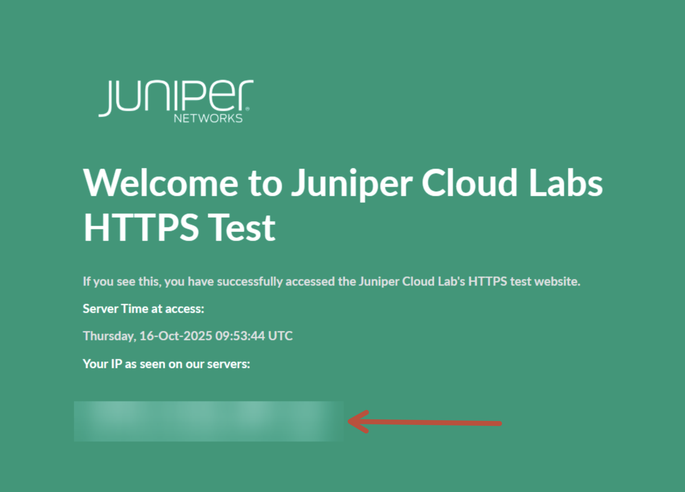

Copy this IP and add it to your JCL Sandbox allowed network prefixes. In order to do that, go to `COMMANDS` and on the right hand side, click on `Add Allow Network Prefixes`:

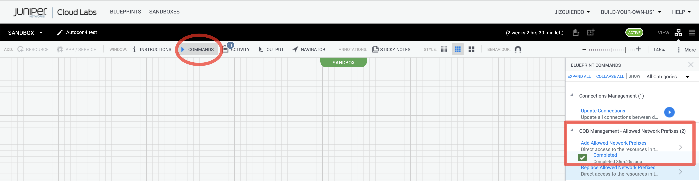

Add it and then click `Run`.

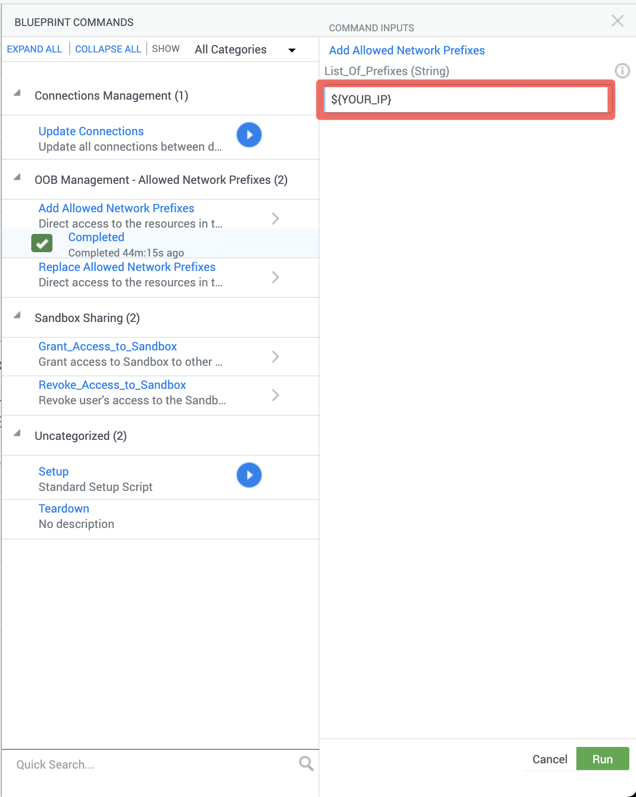

You should see a window with a console output running a script to add your prefix to JCL so you can access your sandbox remotely.

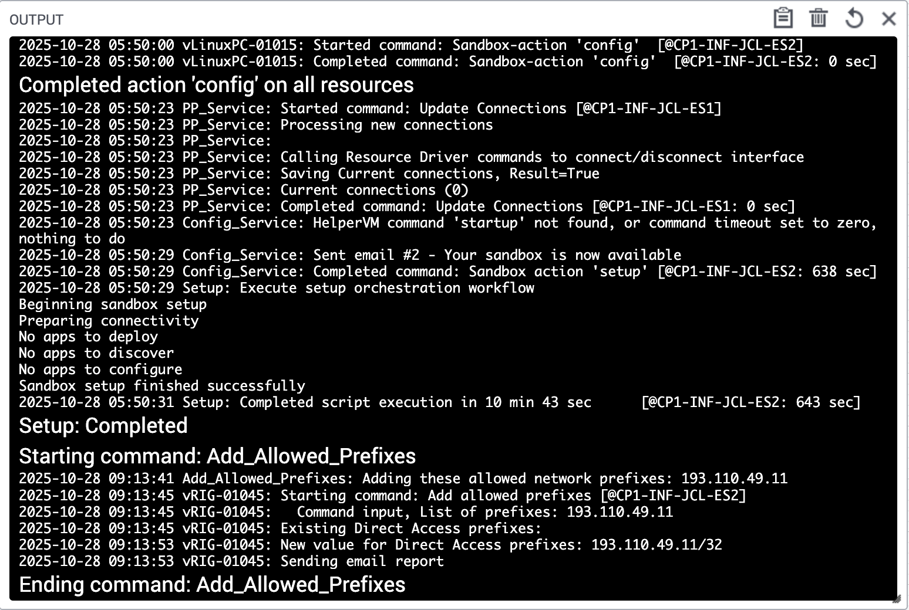

#### 4. Test SSH Connectivity
Verify your SSH configuration:

```bash
# Test VM access
ssh naf-ws-vm

# Test router access (after any use case topology has been deployed! Else, it will not work)
ssh pe1
ssh pe2
ssh pe3
ssh pe4
ssh pe5
ssh pe6
```

### Connect to your VM

1. **Check aliases**

A few aliases have been added to the VM so you can navigate to the interesting folders easily:

```bash
$ alias | grep go
alias gojunosmcp='cd ~/mcps/junos-mcp-server'
alias golinuxmcp='cd ~/mcps/linux-mcp-server'
alias gomcps='cd ~/mcps/'
alias gousecase1='cd ~/workspace/uc1-lldp'
alias gousecase2='cd ~/workspace/uc2-ifs-desc'
alias gousecase3='cd ~/workspace/uc3-ospf'
alias gousecase4='cd ~/workspace/uc4-isis'
alias gousecase5='cd ~/workspace/uc5-j2'
alias gousecase6='cd ~/workspace/uc6-l3vpn'
alias gousecase7='cd ~/workspace/uc7-jvd'
alias gousecase8='cd ~/workspace/uc8-health'
alias goutils='cd ~/workspace/utils'
alias goworkspace='cd ~/workspace'
```

2. **Navigate to your JunOS MCP server repo**:

    Use the alias (`gojunosmcp`) to go directly and explore it:

	```bash
	$ gojunosmcp
	claude@clab-vm:~/mcps/junos-mcp-server (main)$ 
	```

3. **Navigate to your Linux MCP server repo**:

    Use the alias (`golinuxmcp`) to go directly and explore it:

	```bash
	$ golinuxmcp
	claude@clab-vm:~/mcps/linux-mcp-server (main)$ 
	```

4. **Navigate to your workspace**:

    Use the alias (`goworkspace`) to go directly to it:

	```bash
	goworkspace
	claude@clab-vm:~/workspace (main)$ 
	```

5. **Familiarize with the repo and the use cases**:

	Here you can find all the documentation and use cases that we are going to explore during the workshop:

	```bash
	claude@clab-vm:~/workspace (main)$ ls -la
	```

	Use the alias to go to the different use cases (e.g. `gousecase1`) and read the README.md files to understand each use case. You can open them with the webbrowser or VSCode Preview for a better experience.

	```bash
	$ gousecase1
	claude@clab-vm:~/workspace/uc1-lldp (main)$ 

	cat README.md
	```

### Configure Visual Studio Code

Once you've successfully established SSH access to the workshop VM, you can use **Visual Studio Code** to connect to your assigned VM, and use it as your development environment. Follow these steps to set up your development workspace:

1. Install and use the SSH Remote Extension: Open Visual Studio Code and install the **Remote - SSH** extension from the Extensions marketplace if you haven't already. This red square in below picture is the icon of the **extensions** section:

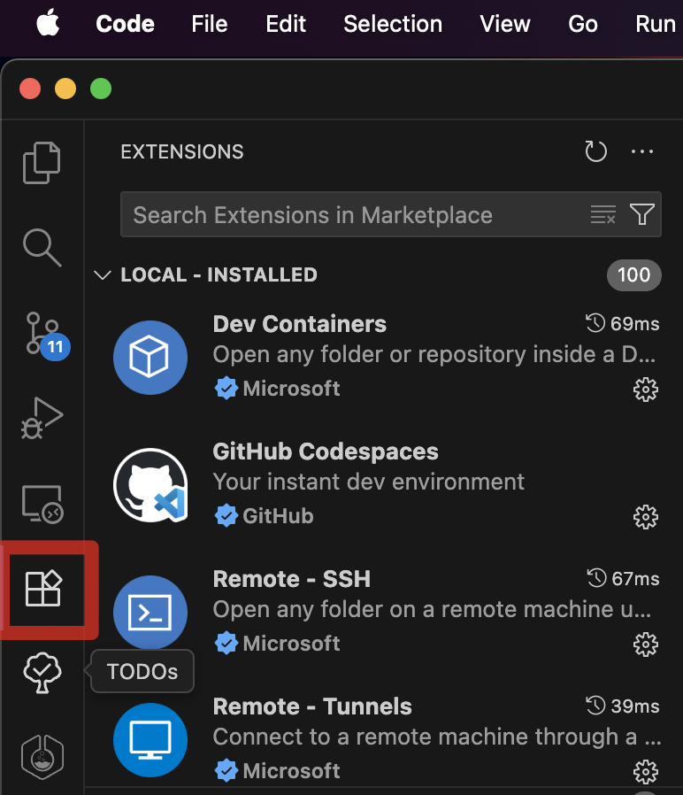

2. Once installed, click on the green/blue remote connection icon in the bottom-left corner of VS Code. Select **Connect to Host** and choose the VM from your SSH config, or enter the connection string directly (e.g. `naf-ws-vm`). VS Code will establish a remote connection and reload in the context of the VM. This arrow is pointing to it:

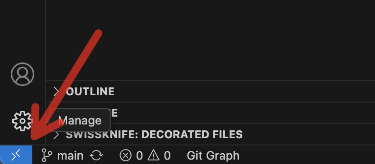

3. Open the Workshop Folder: After connecting to the remote VM, go to `File` > `Open Folder`. Navigate to and select the **~/workspace** directory, then click **OK**. This will open the workshop repository in your VS Code workspace.

4. Install the **ContainerLab** extension in the workshop VM. With your remote connection active, open the Extensions view. Search for **ContainerLab** and install the ContainerLab VS Code extension. Note that this extension will be installed on the remote VM, not your local machine, which is exactly what we want for this workshop.

6. Install the other extensions in the workshop VM the same way as above:
    - Markdown Preview Enhanced (recommended)
    - Markdown All in One (recommended)
    - Auto-Open Markdown Preview (recommended)

7. In the Explorer sidebar, navigate to the root folder of the repository and locate the **README.md** file. Double-click it to open and review the workshop instructions and repository documentation. The **Auto-Open Markdown Preview** extension should open it in a formatted view.

You're now ready to begin working with the lab environment directly from Visual Studio Code!

### MCP hosts

Different AI platforms can serve as MCP hosts, allowing for enhanced agentic capabilities through standardized integrations. MCP hosts act as environments where AI models can:

- Connect to external tools and services
- Access real-time data and APIs
- Execute commands and interact with systems
- Maintain context across complex workflows

You can choose between these 2 MCP host applications:

- Claude Desktop
- Github Copilot (integrated with Visual Studio Code)

However, the workshop will be run with Claude Desktop.

#### Claude Desktop

Claude Desktop application is the selected MCP host for the workshop. It provides a user-friendly interface for interacting with agentic AI capabilities while maintaining control over external connections.

1. **Install Claude Desktop**

	Install Claude Desktop application in your laptop if you did not have it installed.

2. **Launch Claude Desktop**

	Open your `Claude Desktop` application in your laptop.

3. **License**

	Configure your license (recommended **PRO**) as mentioned in the pre-requisites of this workshop. You can find more details at:

	- https://www.claude.com/pricing

4. **Configure Claude Desktop MCP servers**

	Go to your `Claude Desktop` settings (e.g. `Claude Desktop` > `Settings`).

	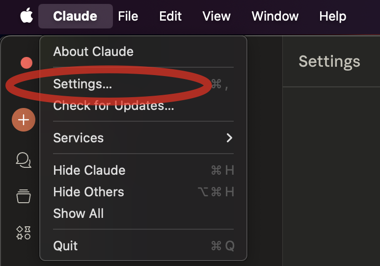

	Go to developer and then click on edit the configuration file (e.g. `claude_desktop_config.json`) with any Text Editor (VSCode recommended!)

	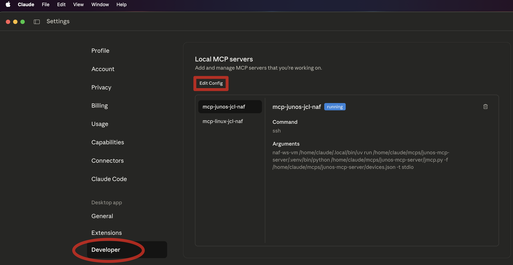

	**NOTE**: Remember to use the same `hostname` that you used in your SSH config file (e.g. `naf-ws-vm`). If you do it wrong, you will not be able to connect Claude Desktop to your MCPs passwordless.

	Update your `claude_desktop_config.json` config file with the following data. Make sure if you got already other MCP servers configured that you do it right (respect `,` and `{` or `}` from the JSON file).

	```json
	{
		"mcpServers": {
			"junos-mcp-jcl-naf": {
				"type": "stdio",
				"command": "ssh",
				"args": [
					"naf-ws-vm",
					"/home/claude/.local/bin/uv",
					"run",
					"/home/claude/mcps/junos-mcp-server/.venv/bin/python",
					"/home/claude/mcps/junos-mcp-server/jmcp.py",
					"-f",
					"/home/claude/mcps/junos-mcp-server/devices.json -t stdio"
				],
				"cwd": "/home/claude/mcps/junos-mcp-server/"
			},
			"linux-mcp-jcl-naf": {
				"type": "stdio",
				"command": "ssh",
				"args": [
					"naf-ws-vm",
					"/home/claude/.local/bin/uv",
					"run",
					"/home/claude/mcps/linux-mcp-server/.venv/bin/python",
					"/home/claude/mcps/linux-mcp-server/linux-mcp-server.py"
				],
				"cwd": "/home/claude/mcps/linux-mcp-server/"
			}
		},
		"globalShortcut": ""
	}
	```

	Windows users should install Git Bash and replace the 2 command lines with this:
	```json
	"command": "C:/Program Files/Git/usr/bin/ssh.exe",
	```

5. **Restart Claude Desktop application**

	`Close` and `open` again the application to reload the configuration.

6. **Check Claude Desktop logs** 

	If you do not see any errors while launching the app, you should be fine. Else check the `logs` related to your MCP servers (**linux-mcp-jcl-naf.log** and **junos-mcp-jcl-naf.log**) and begin your AI-assisted network automation journey!

	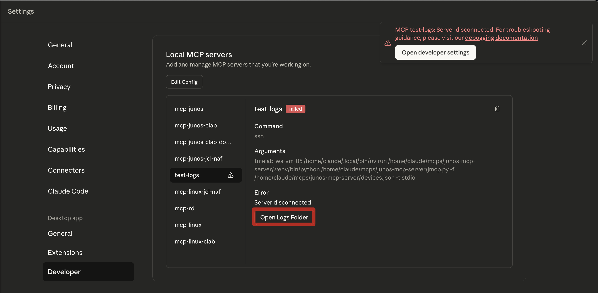

7. **Next steps**

	Now, whenever you start using your MCP and Claude recognizes it can make use of any tools from your MCP servers, you will be prompted if it can use that specific tool the first time it ever makes use of it. Click **ALWAYS_ALLOW** if you Do not want to be prompted again, or **ALLOW_ONCE** if you prefer to be prompted every time it make uses of it (not recommended).

	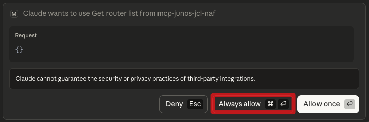

#### Github Copilot (in Visual Studio Code)

GitHub Copilot in VS Code represents a different approach to agentic AI integration, primarily focused on development workflows within the IDE environment. However, it can also be used as an MCP host. In order to configure it as your MCP host, follow these steps:

1. **Launch Visual Studio Code**

	Go to your `Visual Studio Code` and connect to the remote VM you have been assigned with the Remote SSH extension.

2. **Open folder in Remote VM**

	Open folder named `workspace` and create a folder inside it named `.vscode`. Create a file named `mcp.json` and add below content:

	```json
	{
		"servers": {
			"junos-mcp-jcl-naf": {
				"type": "stdio",
				"command": "ssh",
				"args": [
					"naf-ws-vm",
					"/home/claude/.local/bin/uv",
					"run",
					"/home/claude/mcps/junos-mcp-server/.venv/bin/python",
					"/home/claude/mcps/junos-mcp-server/jmcp.py",
					"-f",
					"/home/claude/mcps/junos-mcp-server/devices.json -t stdio"
				]
			},
			"linux-mcp-jcl-naf": {
				"type": "stdio",
				"command": "ssh",
				"args": [
					"naf-ws-vm",
					"/home/claude/.local/bin/uv",
					"run",
					"/home/claude/mcps/linux-mcp-server/.venv/bin/python",
					"/home/claude/mcps/linux-mcp-server/linux-mcp-server.py"
				]
			}
		}
	}
	```

	This screenshot is an example of it:

	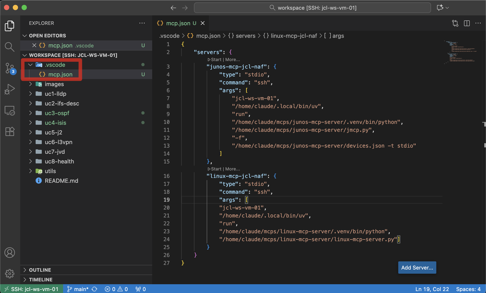

3. **Open AI Chat**

	Open the chat of the AI agent in Visual Studio Code. You can find it in the red square in below picture:

	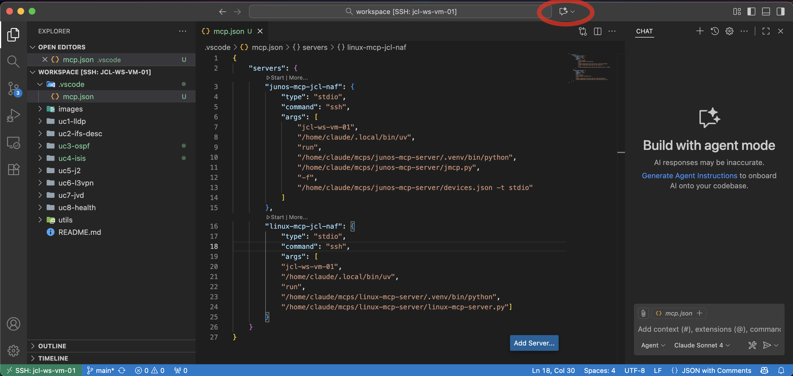

4. **Configure Tools in AI chat**

	At the chat, go to the tools icon and click there.

	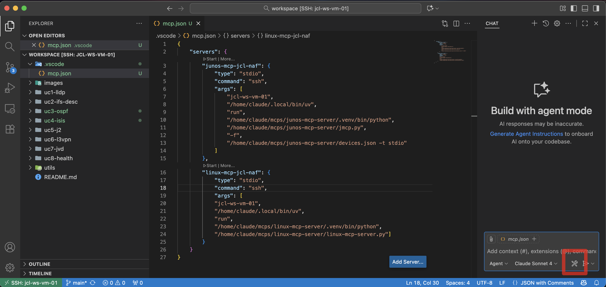

5. **Select NAF workshop MCPs**

	A list of MCPs will be shown (some built-in, some might be yours already, and the ones that you have just configured!). Write `NAF` to filter the currently configured MCP servers and select them. 

	Once both MCPs are selected, you can start them and start your workshop. See below screenshot:

	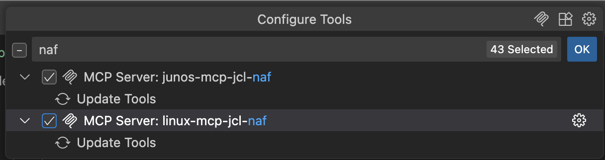

## Key Learning Outcomes

### **Technical Skills**
- Understand MCP-based network automation
- Implement AI-assisted configuration workflows
- Develop intelligent troubleshooting procedures
- Create automated testing and validation

### **Operational Excellence**
- Reduce manual configuration errors
- Accelerate network deployment timelines
- Improve troubleshooting accuracy and speed
- Enhance documentation and change tracking

### **Strategic Value**
- Transform from reactive to proactive operations
- Scale network management capabilities
- Increase operational reliability and consistency
- Develop future-ready automation skills

## Workshop Resources

### **Documentation**
- Individual README files for each use case
- Step-by-step guided prompts for AI interaction
- Technical reference materials and best practices
- Troubleshooting guides and common scenarios

### **Support Materials**
- Configuration templates and examples
- Topology diagrams and network maps
- Validation scripts and testing procedures
- Reference architectures and design patterns

## Success Metrics

By workshop completion, you will have:

- ✅ **Deployed** 8 different network topologies using Container Lab
- ✅ **Configured** protocols using AI-assisted automation
- ✅ **Analyzed** network health and performance using intelligent tools
- ✅ **Troubleshot** complex scenarios with AI-powered root cause analysis
- ✅ **Validated** configurations using automated testing frameworks
- ✅ **Generated** comprehensive documentation and reports
- ✅ **Mastered** the MCP framework for network automation

## Milestones

The milestones listed below in each use case serve as a progress tracker and learning checkpoint. Each task represents a key milestone. As you work through the steps in the use case (either `manual steps` or `AI prompts`), these tasks provide a clear visual indicator of the progress and accomplishments. This checklist approach helps you maintain focus, ensures no critical steps are missed, and gives you a sense of achievement as you advance through the use case. By the end, you'll have a comprehensive record of the steps done and the automation workflows you've successfully executed.

## Next Steps

After completing this workshop:

1. **Apply learned concepts** to your production environments
2. **Expand automation scope** to additional network functions
3. **Integrate MCP** with existing automation toolchains
4. **Share knowledge** with your team and organization
5. **Continue learning** with advanced MCP applications

## Support & Community

- **Workshop Proctors**: Available for hands-on assistance
- **AutoCon4 Community**: Connect with fellow network automation practitioners
- **HPE Juniper Networks**: Ongoing support and resources
- **Network Automation Forum**: Continued learning and collaboration
- **Claude status**: Check Claude (LLM) status at [https://status.claude.com/](https://status.claude.com/)

---

<!--

## Extra documentation

This section explains any extra guides or documents required to set up the environment. However, I am using Ansible to configure all VMs the same way, so no need to follow below guides.

The project I am using for that is:

- [Workshop VMs manager](https://auto-vm.englab.juniper.net/tme/workshop-vms-mngr)

### Guides

Make sure you follow below guides to set up the environment required to run this workshop:

- [Linux.md](LINUX.md)
- [ClaudeDesktop.md](ClaudeDesktop.md) 
-->

**Ready to transform your network operations? Let's dive in! 🚀**

*This workshop represents the cutting edge of network automation, combining the power of AI with proven networking technologies to create unprecedented operational efficiency and intelligence.*

