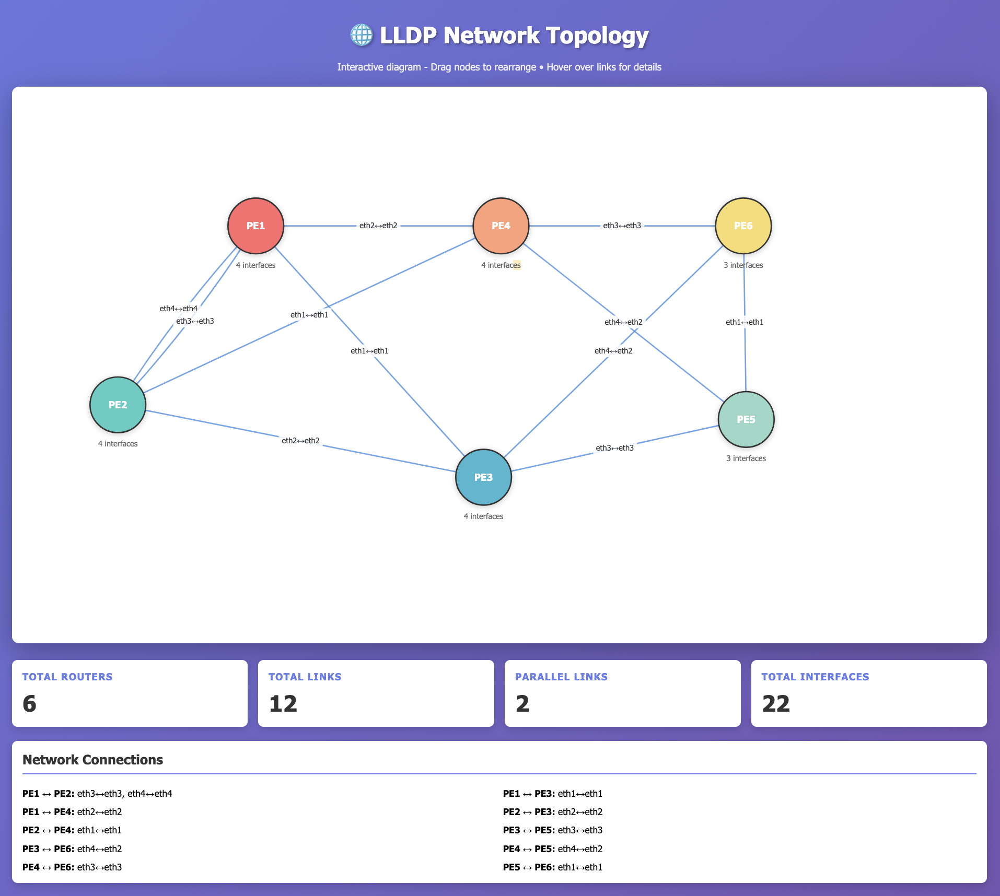

# Use Case #1 - LLDP

## Quick Links
- [Intro](#intro)
- [Summary](#summary)
- [Steps](#steps)
- [Milestones](#milestones)
- [Outcomes](#outcomes)
- [What's next?](#whats-next)

## Intro

This `use case #1` is based on `LLDP`. LLDP (Link Layer Discovery Protocol) is a network discovery protocol that helps network devices automatically identify and learn about their directly connected neighbors. Think of it as a way for network devices to "introduce themselves" to each other.

## Summary

The scenario begins with automated topology deployment through containerlab, where Claude uses the Linux MCP server to spin up six cRPD routers with baseline configurations. The AI agent then autonomously configures LLDP across all physical interfaces, enabling neighbor discovery and connectivity mapping. Users maintain visibility through manual verification—monitoring syslog output, executing operational commands, and comparing the AI-generated topology diagram against the actual containerlab topology. The workflow culminates with the AI agent generating interface descriptions based on LLDP data and creating an interactive network visualization.

## Steps

This section outlines the sequential workflow for completing the use case, combining both `manual verification` steps and `AI-assisted automation prompts`. Each step is designed to build upon the previous one, creating a logical progression from initial environment setup through configuration, validation, and teardown.

- **Manual steps** allow you to observe and verify the AI agent's actions, ensuring transparency and providing learning opportunities to understand what's happening behind the scenes. A few recommendations are provided. Feel free to do them (execute commands, read docs, etc..).
    They are identified as **X. Manual -** (where X is the step number) inside this **Steps** section.
- **AI prompt steps** leverage Claude Desktop with MCP servers to automate complex network operations, demonstrating how natural language instructions can be translated into precise network configurations and operational commands. Copy/Paste the **whole prompt block** into Claude chat.
    They are identified as **X. Prompts -** (where X is the step number) inside this **Steps** section.

By following these steps in order, you'll experience a complete network automation workflow that balances human oversight with AI efficiency, giving you hands-on experience with modern network operations practices while maintaining full visibility and control over the process.

Feel free to test also with your own prompts (at your own risk ⚠️ ) so you can play, test and understand that prompts are one way of providing context to the AI agent and depending on what you write, the AI agent will act in a different way.

This is the list of suggested steps in use case #1:

📢 **Suggestion: Start a new chat for this use case!**

#### 1. Prompt - Deploy topology

> 1. Connect to the Linux VM and go to the directory named `/home/claude/workspace/uc1-lldp/`. This will be your `workspace` for this `use case #1 (LLDP)`.
> 2. Deploy the container lab topology file (`uc1-lldp.clab.yml`). No `sudo` required.
> 3. Verify that the state of all the containers from that topology is `running`.
> 4. Do not do anything else.

This step corresponds to `milestone #1` 🚩.

#### 2. Manual - Connect to the topology routers

Connect directly to the topology routers to inspect and verify their configurations and operational state.

```bash
ssh pe1
ssh pe2
...
```

Issue the following commands:

- show configuration
- show lldp (LLDP protocol should be Disabled)
- show lldp neighbors (Empty)

You can leave the connection open since it will be reused a few steps further.

This step corresponds to `milestone #2` 🚩.

#### 3. Prompt - LLDP

> 1. Remember cRPD JunOS devices have Linux interfaces names (e.g. `eth1` or `eth2`), not JunOS interfaces ones (e.g. `ge-0/0/0` or `ge-0/0/1`). Do not configure anything inside the cRPD which does not have a Linux interface name (i. e. No `ge-*` interfaces. Only `eth*`). They are mapped as follows:
>    - Management:
>      - eth0 → fxp0
>    - Physical:
>      - eth1 → ge-0/0/0
>      - eth2 → ge-0/0/1
>      - eth3 → ge-0/0/2
>      - and so on...
> 2. Configure LLDP protocol across all 6 routers in every physical interface (e.g. `ethX where X is [1,2,...]`) except the management one (`eth0`).
> 3. After configuring LLDP on all router interfaces, perform comprehensive verification and data collection:
>     - Verify LLDP is running properly on all routers by checking:
>       - LLDP service status
>     - Collect complete LLDP neighbor discovery information from all routers:
>       - Show all discovered LLDP neighbors with their interface mappings
>       - Identify remote router names and their connecting interfaces
>       - Map the complete network topology based on neighbor data
>     - Validate the LLDP discovery data by:
>       - Confirming bidirectional neighbor relationships
>       - Checking for any LLDP configuration issues or missing connections
> 4. Do not do anything else.

This step corresponds to `milestone #3` 🚩.

#### 4. Manual - Connect to the topology routers

Connect directly to the topology routers to monitor what the AI agent (e.g. `claude` user) is doing. Issue the following commands:

- monitor start messages (it will show live what user `claude` is doing in the router as per syslog configuration)
- show lldp (Enabled)
- show lldp neighbors (Some neighbors)

This step corresponds to `milestones #4 and #5` 🚩.

#### 5. Prompt - Interfaces description

> 1. Based on the LLDP neighbor discovery information collected, configure meaningful interface descriptions on all routers. For each interface that has an LLDP neighbor, set the description to follow this format: `$Local_Router $Local_Interface <-> $Remote_Router $Remote_Interface`. For example, if `eth2` on `PE1` connects to `PE3` on `eth4`, set interface description to: `PE1 eth2 <-> PE3 eth4`.
> 2. Apply this configuration to all discovered LLDP neighbors across all routers.
> 3. Skip any interfaces without LLDP neighbors.
> 4. Use the exact LLDP data collected to create an `interactive HTML topology diagram` where nodes can be dragged and dropped to rearrange the network layout while maintaining connection visualization (Do not save it at the workspace!). 
>     - Include interface labels showing the connection mappings.
>     - When multiple links exist between the same pair of routers (parallel links), ensure they are visually distinct and separately visible by using curved paths with offsets.
>     - Each link should have its own path and interface label so that all redundant connections are clearly identifiable.
> 5. Do not do anything else.

This step corresponds to `milestones #6 and #7` 🚩.

#### 4. Prompt - Destroy the topology

1. 💡tip: This is the end of this use case. Do not destroy the topology if you still want to play a bit until the rest of the people finish or proctors move the the next one.
2. 💡tip: If you feel comfortable with ContainerLab and Linux, you can **save some tokens** by destroying the topology yourself through the CLI issuing the following commands:

```bash
claude@jcl-ws-vm-01:~ $ gousecase1
claude@jcl-ws-vm-01:~/workspace/uc1-lldp (main)$ 

claude@jcl-ws-vm-01:~/workspace/uc1-lldp (main)$ clab destroy -c
11:02:43 INFO Parsing & checking topology file...
11:02:43 INFO Destroying lab name...
11:02:47 INFO Removed container name...
11:02:47 INFO Removing host entries path=/etc/hosts
11:02:47 INFO Removing SSH configs...
claude@jcl-ws-vm-01:~/workspace/uc1-lldp (main)$ 
```

else, ask the AI agent to do it for you with this prompt:

> 1. Destroy the container lab topology from `use case #1 (LLDP)` workspace and clean up the environment.
> 2. Do not add any environment cleanup summary.

This step corresponds to `milestone #8` 🚩.

---

📢 **Suggestion: Rename this chat in Claude Desktop App to `UC1 - LLDP`!**

---

## Milestones

These are the milestones accomplished in this use case (either manually or by prompting the AI agent):

1. 🚩 Prompt - Ask our AI agent to connect to the Linux server and deploy a Container Lab topology (Linux MCP).
2. 🚩 Manual - Connect to the network of cRPD devices.
3. 🚩 Prompt - Ask our AI agent to configure `LLDP` in all physical interfaces of the topology to understand the cRPDs interconnections (JunOS MCP).
4. 🚩 Manual - `Monitor` the actions of the AI agent in the cRPDs via `syslog`.
5. 🚩 Manual - Run some `operational commands` to validate what the AI agent is doing (`show lldp`, `show lldp`, and `show lldp neighbors`).
6. 🚩 Prompt - Ask our AI agent to `configure` interface descriptions based on the LLDP information (JunOS MCP).
7. 🚩 Manual - Open the `topology diagram` generated and compare it to the Container Lab (topoviewer) to see the accuracy of the AI agent actions.
8. 🚩 Prompt or Manual - Destroy the containerlab topology and clean up the environment.

---

## Outcomes

This is a screenshot of one of the topology diagram generated when preparing this workshop:



You can find also the `interactive HTML topology diagram` generated here:

[UC1 topology diagram](../uc1-lldp/report/lldp_topology.html)
