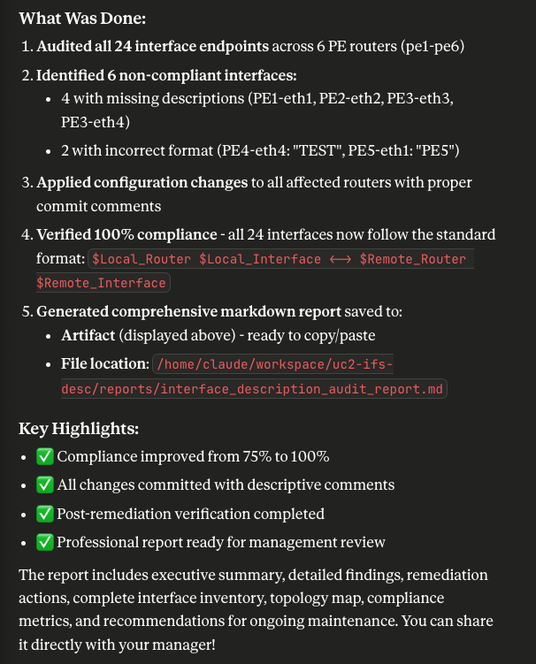

# Use Case #2 - Interfaces descriptions

## Quick Links
- [Intro](#intro)
- [Summary](#summary)
- [Steps](#steps)
- [Milestones](#milestones)
- [Outcomes](#outcomes)
- [What's next?](#whats-next)

## Intro

This use case demonstrates how an AI agent can be used to `audit` and `remediate` network configurations.

## Summary

After deploying a containerlab topology with baseline configurations, users manually introduce inconsistencies into the network—removing interface descriptions from several routers and changing naming conventions on others to create a realistic drift scenario. The AI agent is then tasked with auditing the entire network, discovering these discrepancies by comparing actual configurations against expected standards derived from LLDP neighbor data. Once the audit reveals missing and inconsistent interface descriptions, the AI agent automatically remediates the issues, restoring proper naming conventions and filling in gaps across all routers. This workflow demonstrates how AI can maintain configuration consistency at scale, identifying human errors or configuration drift that would be tedious to detect manually, while providing detailed reports on what was found and corrected.

## Steps

This section outlines the sequential workflow for completing the use case, combining both `manual verification` steps and `AI-assisted automation prompts`. Each step is designed to build upon the previous one, creating a logical progression from initial environment setup through configuration, validation, and teardown.

- **Manual steps** allow you to observe and verify the AI agent's actions, ensuring transparency and providing learning opportunities to understand what's happening behind the scenes. A few recommendations are provided. Feel free to do them (execute commands, read docs, etc..).
    They are identified as **X. Manual -** (where X is the step number) inside this **Steps** section.
- **AI prompt steps** leverage Claude Desktop with MCP servers to automate complex network operations, demonstrating how natural language instructions can be translated into precise network configurations and operational commands. Copy/Paste the **whole prompt block** into Claude chat.
    They are identified as **X. Prompts -** (where X is the step number) inside this **Steps** section.

By following these steps in order, you'll experience a complete network automation workflow that balances human oversight with AI efficiency, giving you hands-on experience with modern network operations practices while maintaining full visibility and control over the process.

Feel free to test also with your own prompts (at your own risk ⚠️ ) so you can play, test and understand that prompts are one way of providing context to the AI agent and depending on what you write, the AI agent will act in a different way.

This is the list of suggested steps in use case #2.

📢 **Suggestion: Start a new chat for this use case!**

#### 1. Prompt - Deploy topology

> 1. Connect to the Linux VM and go to the directory named `/home/claude/workspace/uc2-ifs-desc/`. This will be your `workspace` for this `use case #2 (Interface descriptions)`.
> 2. Deploy the container lab topology file (`uc2-ifs-desc.clab.yml`). No `sudo` required.
> 3. Verify that the state of all the containers from that topology is `running`.
> 4. Do not do anything else.

This step corresponds to `milestone #1` 🚩.

#### 2. Manual - Connect to the topology routers

Connect directly to the topology routers to inspect and verify their configurations and operational state. 

Issue the following commands:

- show configuration interfaces | display set | match desc

You can leave the connection open since it will be reused a few steps further.

This step corresponds to `milestones #2 and #3` 🚩.

#### 3. Manual - Modify a few interface descriptions

**Remove** a few of them (randomly). Feel free to remove the ones that you consider!

To delete the interface descriptions, connect to some of those devices (SSH via VS Code Container Lab extension or SSH to them directly) and go to `configuration` mode (see example):

```
claude@pe1> show configuration interfaces | display set | match desc
set interfaces eth1 description "PE1 eth1 <-> PE3 eth1"
set interfaces eth2 description "PE1 eth2 <-> PE4 eth2"
set interfaces eth3 description "PE1 eth3 <-> PE2 eth3"
set interfaces eth4 description "PE1 eth4 <-> PE2 eth4"

claude@pe1> configure
Entering configuration mode

[edit]
claude@pe1# 
```

Remove a few of the interfaces from the routers **randomly**. Issue similar commands to these ones to delete `eth1` and `eth2` descriptions for example:

```
[edit]
claude@pe1# delete interfaces eth1

[edit]
claude@pe1# delete interfaces eth2

[edit]
claude@pe1# show | compare
[edit interfaces]
-   eth1 {
-       description "PE1 eth1 <-> PE3 eth1";
-   }
-   eth2 {
-       description "PE1 eth2 <-> PE4 eth2";
-   }

[edit]
claude@pe1# commit
commit complete
```

Do not forget to **commit** the configuration!

**Change** also the naming convention of a few of them. Feel free to change the ones that you consider!

For example, change from `PE4 eth1 <-> PE2 eth1` to `PE4 <<-------->> PE2`) or something else, like below example with `eth3` interface description:

```
claude@pe1# show | compare
[edit interfaces eth3]
-   description "PE1 eth3 <-> PE2 eth3";
+   description "A A B B";

[edit]
claude@pe1# commit
commit complete
```

Do not forget to **commit** the configuration!

This step corresponds to `milestones #4 and #5` 🚩.

#### 4. Prompt - Audit Interfaces descriptions

> 1. Check if every network device physical interface have a description set. 
> 2. Verify if they are matching the following format: `$Local_Router $Local_Interface <-> $Remote_Router $Remote_Interface`.
> 3. Report those which are either `empty` or `not following the naming convention` and propose a configuration change for it.
> 4. Ask me for confirmation before committing the config.

After this prompt, the agent is waiting for you to answer the question.

This step corresponds to `milestone #6` 🚩.

#### 5. Prompt - Fix Interfaces description

This is the reply to confirm the application of the configuration changes suggested above.

> 1. Apply these configuration changes.
> 2. Generate a markdown report out of this audit task so I can share it with my manager.
> 3. Do not include any ASCII art diagram in the markdown report.

This step corresponds to `milestone #7` 🚩.

#### 6. Prompt - Destroy the topology

1. 💡tip: This is the end of this use case. Do not destroy the topology if you still want to play a bit until the rest of the people finishes or proctors move the the next one.
2. 💡tip: If you feel comfortable with ContainerLab and Linux, you can **save some tokens** by destroying the topology yourself through the CLI issuing the following commands:

```bash
claude@jcl-ws-vm-01:~ $ gousecase2
claude@jcl-ws-vm-01:~/workspace/uc2-ifs-desc (main)$ 

claude@jcl-ws-vm-01:~/workspace/uc2-ifs-desc (main)$ clab destroy -c
11:02:43 INFO Parsing & checking topology file...
11:02:43 INFO Destroying lab name...
11:02:47 INFO Removed container name...
11:02:47 INFO Removing host entries path=/etc/hosts
11:02:47 INFO Removing SSH configs...
claude@jcl-ws-vm-01:~/workspace/uc2-ifs-desc (main)$ 
```

else, ask the AI agent to do it for you with this prompt:

> 1. Destroy the container lab topology from `use case #2 (Interface descriptions)` workspace and clean up the environment.
> 2. Do not add any environment cleanup summary.

This step corresponds to `milestone #8` 🚩.

---

📢 **Suggestion: Rename this chat in Claude Desktop App to `UC2 - Interface Descriptions`!**

---

## Milestones

These are the milestones accomplished in this use case (either manually or by prompting the AI agent):

1. 🚩 Prompt - Ask our AI agent to connect to the Linux server and deploy a Container Lab topology (Linux MCP).
2. 🚩 Manual - Connect to the network of cRPD devices.
3. 🚩 Manual - Check all the physical interface descriptions are configured.
4. 🚩 Manual - Remove a few interface descriptions (randomly). Feel free to remove the ones that you consider!
5. 🚩 Manual - Change the naming convention also of a few of them (e.g. from `PE4 eth1 <-> PE2 eth1` to `PE4 <---> PE2`)
6. 🚩 Prompt - Ask the AI agent to audit the interface descriptions from our network and see what it figures out.
7. 🚩 Prompt - Confirm to fix the interface descriptions and issue a report.
8. 🚩 Prompt or Manual - Destroy the containerlab topology and clean up the environment.

---

## Outcomes

Here there are 2 outcomes when running this use case:

1. This is the report generated to be shared with the Network Operations manager:

[Interface description audit report](reports/interface_description_audit_report.md)

2. This is a screenshot of one of the AI agent chat when running this workshop use case:



### What's next?

Imagine now combining `uc1 (LLDP)` and `uc2 (Interface descriptions)`. Not like configuring LLDP and then the interfaces descriptions, as in here:

```
uc1 (LLDP) -> uc2 (Interface descriptions)
```

But like assuming interface descriptions were configured by a different system and the AI agent is auditing it. For that, use LLDP to extract the real physical data from the network:

```
uc2 (Interface descriptions) -> uc1 (LLDP)
```

We have seen that the LLM has checked the local interface and local host to check if matching the naming convention, but in this second use case, it did not configure LLDP to match existing configuration data with physical data. If so, that would mean the AI agent will do a double check. Not only the local router and interface, but also the other end of the link, the `$Remote_Router` and `$Remote_Interface`.
