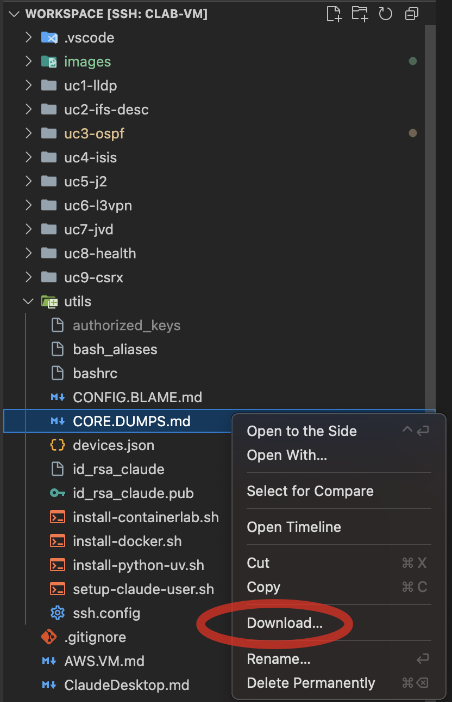
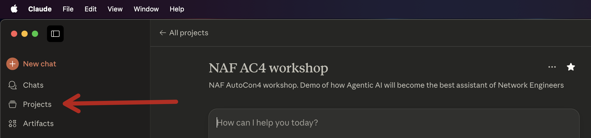
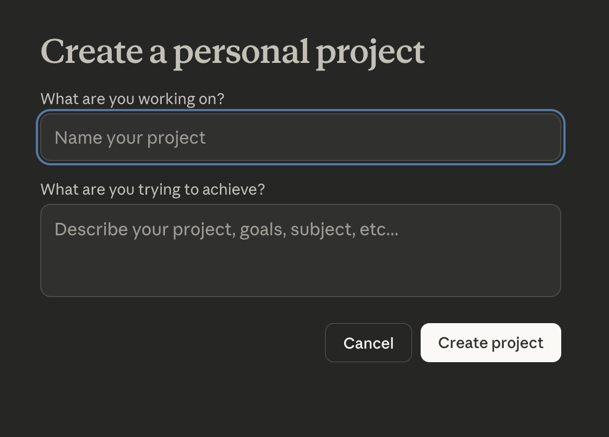
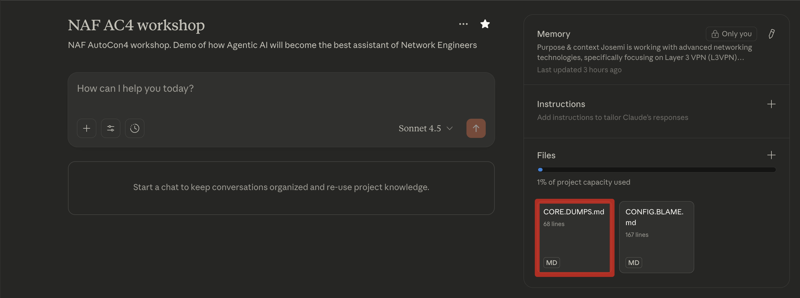

# Use Case #3 - OSPF & Core dump

## Quick Links
- [Intro](#intro)
- [Summary](#summary)
- [Steps](#steps)
- [Milestones](#milestones)
- [Outcomes](#outcomes)
- [What's next?](#whats-next)

## Intro

This use case demonstrates how an AI agent can be used to check the `health` of our network. Unexpected core dumps can signal critical issues ranging from memory corruption to protocol state inconsistencies that threaten network stability.

### Core Dumps

A `core dump` in JunOS is a snapshot of a process's memory contents captured at the moment a process crashes or encounters a fatal error. Think of it as a "forensic photograph" of what was happening inside the software when something went wrong. This core dump can then later be analyzed by Juniper Technical Assistance Center (JTAC) to determine a possible root cause.

When a core dump occurs it's essential to rapidly assess the overall network health to determine whether the issue is isolated to a single node or represents a systemic problem that could cascade across the topology. This use case demonstrates how an AI agent can systematically analyze the network state following a forced core dump scenario, leveraging Junos operational commands.

#### Core Dump document

This document is a guide to help retrieve JunOS core-dump files from a network device as **non-root** user. Feel free to review and understand the purpose of it.

- [CORE.DUMPS.md](../utils/CORE.DUMPS.md)

This document must be attached/uploaded to the Claude Desktop projects. That way, any `documents`, `code`, or any other `file` added to the project can be used by Claude and being referenced in your chats. In order to do that, follow below instructions:

1. Download the **CORE.DUMPS.md** from the `utils/` folder (either from the repo or your VSCode Explorer):



2. In the application menu, select `Projects`. You can see it here:



3. Click on`+ New Project` on the top right corner. Give it a name (e.g. `NAF AC4 workshop`)



4. Once you got it created, upload the **CORE.DUMPS.md** to the **files** section. This is how it should look like once it has been added:



## Summary

This use case demonstrates AI-powered post-incident forensic analysis following a routing process crash. After deploying an **OSPF-enabled** topology and verifying normal operations, users manually force a routing daemon (rpd) crash to simulate a critical failure. The AI agent conducts a comprehensive health check—verifying OSPF neighbors, database consistency, and routing tables—then discovers and analyzes the core dump file. The AI extracts critical crash information including process details, error messages, JunOS version, and stack traces to determine the root cause, demonstrating how AI can accelerate incident resolution that typically requires JTAC involvement.

## Steps

This section outlines the sequential workflow for completing the use case, combining both `manual verification` steps and `AI-assisted automation prompts`. Each step is designed to build upon the previous one, creating a logical progression from initial environment setup through configuration, validation, and teardown.

- **Manual steps** allow you to observe and verify the AI agent's actions, ensuring transparency and providing learning opportunities to understand what's happening behind the scenes. A few recommendations are provided. Feel free to do them (execute commands, read docs, etc..).
    They are identified as **X. Manual -** (where X is the step number) inside this **Steps** section.
- **AI prompt steps** leverage Claude Desktop with MCP servers to automate complex network operations, demonstrating how natural language instructions can be translated into precise network configurations and operational commands. Copy/Paste the **whole prompt block** into Claude chat.
    They are identified as **X. Prompts -** (where X is the step number) inside this **Steps** section.

By following these steps in order, you'll experience a complete network automation workflow that balances human oversight with AI efficiency, giving you hands-on experience with modern network operations practices while maintaining full visibility and control over the process.

Feel free to test also with your own prompts (at your own risk ⚠️ ) so you can play, test and understand that prompts are one way of providing context to the AI agent and depending on what you write, the AI agent will act in a different way.

This is the list of suggested steps in use case #3:

📢 **Suggestion: Start a new chat for this use case!**

#### 1. Prompt - Deploy topology

> 1. Connect to the Linux VM and go to the directory named `/home/claude/workspace/uc3-ospf/`. This will be your `workspace` for this `use case #3 (OSPF & Core dump)`.
> 2. Deploy the container lab topology file (`uc3-ospf.clab.yml`). No `sudo` required.
> 3. Verify that the state of all the containers from that topology is `running`.
> 4. Do not do anything else.

This step corresponds to `milestone #1` 🚩.

#### 2. Manual - Connect to the topology routers

Connect directly to the topology routers to inspect and verify their configurations and operational state. 

Issue the following commands to check OSPF in your network:

- show configuration protocols ospf
- show ospf neighbor
- show ospf database
- show ospf overview
- show route protocol ospf

Issue the following commands to check if any core-dumps in your network:

- show system core-dumps

You can leave the connection open since it will be reused a few steps further.

This step corresponds to `milestones #2 and #3` 🚩.

#### 3. Prompt - Check for core-dumps

> Verify there are no `core-dumps` in the network.

This step corresponds to `milestone #4` 🚩.

#### 4. Prompt - Verify OSPF status

> 1. Verify the status of the OSPF network:
>    - Check the OSPF configuration
>    - OSPF neighbor relationships
>    - OSPF database
>    - routing table on all routers.
> 
> 2. Do not issue any reports or summary.

This step corresponds to `milestone #5` 🚩.

#### 5. Manual - Simulate a core-dump in one of the routers

Connect to one of the routers and generate a core-dump manually.

```
claude@pe1> request system core-dump routing fatal

Generating core dump for routing process using fatal method
Available Free space 230849276Kb, Estimated Required free space 1170928Kb
 
claude@pe1>
```

This step corresponds to `milestone #6` 🚩.

#### 6. Prompt - Re-verify OSPF status and look for core-dumps

> 1. Verify `again` the status of the OSPF network:
>    - OSPF neighbor relationships
>    - OSPF database
>    - routing table on all routers.
> 2. After that, search also for any signs of `core-dumps`.
> 3. If any `core-dumps` are found, follow the `CORE.DUMPS.md` document to analyze it and provide a report about it.

This step corresponds to `milestone #7` 🚩.

#### 7. Prompt - Destroy the topology

1. 💡tip: This is the end of this use case. Do not destroy the topology if you still want to play a bit until the rest of the people finish or proctors move the the next one.
2. 💡tip: If you feel comfortable with ContainerLab and Linux, you can **save some tokens** by destroying the topology yourself through the CLI issuing the following commands:

```bash
claude@jcl-ws-vm-01:~ $ gousecase3
claude@jcl-ws-vm-01:~/workspace/uc3-ospf (main)$ 

claude@jcl-ws-vm-01:~/workspace/uc3-ospf (main)$ clab destroy -c
11:02:43 INFO Parsing & checking topology file...
11:02:43 INFO Destroying lab name...
11:02:47 INFO Removed container name...
11:02:47 INFO Removing host entries path=/etc/hosts
11:02:47 INFO Removing SSH configs...
claude@jcl-ws-vm-01:~/workspace/uc3-ospf (main)$ 

claude@jcl-ws-vm-01:~/workspace/uc3-ospf (main)$ rm -rf tmp/
claude@jcl-ws-vm-01:~/workspace/uc3-ospf (main)$ 
```

else, ask the AI agent to do it for you with this prompt:

> 1. Destroy the container lab topology from `use case #3 (OSPF & Core dump)` workspace and clean up the environment.
> 2. Delete the `tmp/` directory and its contents created to SCP de core dump from the network device.
> 3. Do not add any environment cleanup summary.

This step corresponds to `milestone #8` 🚩.

---

📢 **Suggestion: Rename this chat in Claude Desktop App to `UC3 - OSPF & Core Dump`!**

---

## Milestones

These are the milestones accomplished in this use case (either manually or by prompting the AI agent):

1. 🚩 Prompt - Ask our AI agent to connect to the Linux server and deploy a Container Lab topology (Linux MCP).
2. 🚩 Manual - Connect to the network of cRPD devices.
3. 🚩 Manual - Check for any `core-dumps` in the network.
4. 🚩 Prompt - Ask our AI agent to check for any `core-dumps` in the network.
5. 🚩 Prompt - Ask our AI agent to check OSPF is running in my network.
6. 🚩 Manual - Simulate a `core-dump` in a router. Force the `routing` process (rpd) to crash and generate a core dump.
7. 🚩 Prompt - Ask our AI agent to investigate OSPF and the `core dump` and give the traceback from the core dump.
8. 🚩 Prompt or Manual - Destroy the containerlab topology and clean up the environment.
