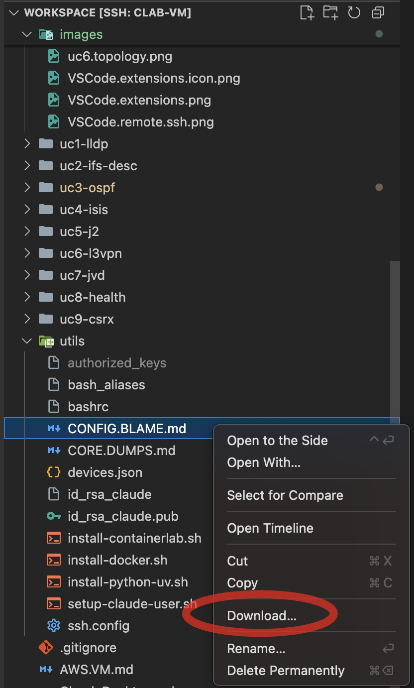
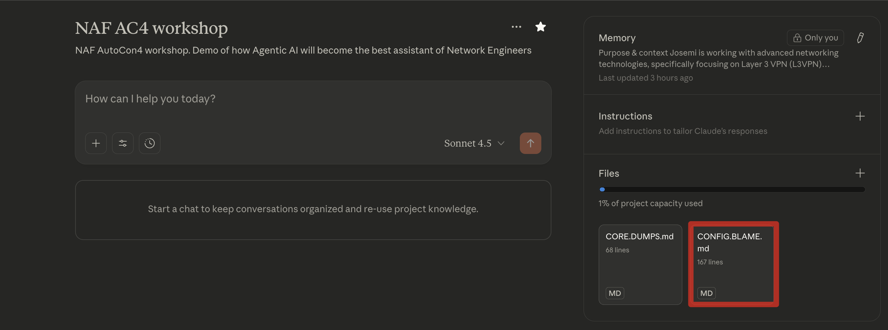

# Use Case #4 - ISIS & Configuration Blame Analysis

## Quick Links
- [Intro](#intro)
- [Summary](#summary)
- [Steps](#steps)
- [Milestones](#milestones)
- [Outcomes](#outcomes)
- [What's next?](#whats-next)

## Intro

This use case demonstrates how an AI agent can perform comprehensive configuration forensics on network devices to establish complete change attribution and traceability.

### Configuration Blame Analysis

In complex network environments, configuration changes (whether **authorized** or **unintended**) can introduce subtle issues that manifest days or weeks after implementation, making root cause analysis (RCA) challenging without proper change tracking mechanisms. When troubleshooting network anomalies, security incidents, or compliance violations, operators need to quickly answer critical questions:

- **Who** made this change?
- **When** was it implemented?
- **What** was the business justification?

This methodology mirrors **Git's blame** functionality but applies it to network configurations, demonstrating how AI can accelerate incident response by automating forensic analysis that would otherwise require manual inspection of commit logs across multiple devices.

#### Configuration Blame Analysis document

This document is a guide to perform the configuration blame analysis. Feel free to review and understand the purpose of it.

- [CONFIG.BLAME.md](../utils/CONFIG.BLAME.md)

This document must be attached/uploaded to the Claude Desktop projects. That way, any `documents`, `code`, or any other `file` added to the project can be used by Claude and being referenced in your chats. In order to do that, follow below instructions:

1. Download the **CONFIG.BLAME.md** from the `utils/` folder (either from the repo or your VSCode Explorer):



2. In the application menu, select `Projects`. You can see it here:


3. Click on`+ New Project` on the top right corner. Give it a name (e.g. `NAF AC4 workshop`)


4. Once you got it created, upload the **CONFIG.BLAME.md** to the **files** section. section. This is how it should look like once it has been added:



## Summary

In a simulated NOC workflow, an **ISIS-enabled** topology undergoes routine automation tasks during a maintenance window (e.g. user provisioning, syslog setup, and interface updates...). One maintenance script, trying to isolate a network device from the routing, accidentally breaks ISIS. The agentic AI investigates, following a best practices document, performing a **Configuration Blame Analysis** that pinpoints the root cause and identifies **who** made the change, **when**, **where** and **why**.

## Steps

This section outlines the sequential workflow for completing the use case, combining both `manual verification` steps and `AI-assisted automation prompts`. Each step is designed to build upon the previous one, creating a logical progression from initial environment setup through configuration, validation, and teardown.

- **Manual steps** allow you to observe and verify the AI agent's actions, ensuring transparency and providing learning opportunities to understand what's happening behind the scenes. A few recommendations are provided. Feel free to do them (execute commands, read docs, etc..).
    They are identified as **X. Manual -** (where X is the step number) inside this **Steps** section.
- **AI prompt steps** leverage Claude Desktop with MCP servers to automate complex network operations, demonstrating how natural language instructions can be translated into precise network configurations and operational commands. Copy/Paste the **whole prompt block** into Claude chat.
    They are identified as **X. Prompts -** (where X is the step number) inside this **Steps** section.

By following these steps in order, you'll experience a complete network automation workflow that balances human oversight with AI efficiency, giving you hands-on experience with modern network operations practices while maintaining full visibility and control over the process.

Feel free to test also with your own prompts (at your own risk ⚠️ ) so you can play, test and understand that prompts are one way of providing context to the AI agent and depending on what you write, the AI agent will act in a different way.

This is the list of suggested steps in use case #4:

📢 **Suggestion: Start a new chat for this use case!**

#### 1. Prompt - Deploy topology

> 1. Connect to the Linux VM and go to the directory named `/home/claude/workspace/uc4-isis/`. This will be your workspace for this use case #4 (Configuration Blame Analysis).
> 2. Deploy the container lab topology file (`uc4-isis.clab.yml`). No `sudo` required.
> 3. Verify that the state of all the containers from that topology is `running`.
> 4. Do not do anything else.

This step corresponds to `milestone #1` 🚩.

#### 2. Manual - Connect to the topology routers

Connect directly to the topology routers to inspect and verify their configurations and operational state. 

Issue the following commands to check ISIS in your network:

- show configuration protocols isis
- show isis interface
- show isis adjacency

This step corresponds to `milestone #2` 🚩.

#### 3. Prompt - Check ISIS in your network

> Check ISIS is running on the routers

This step corresponds to `milestone #3` 🚩.

#### 4. Manual - Run the scripts from the scripts/ folder

Go to the scripts folder:

```
claude@clab-vm:~ $ gousecase4

claude@clab-vm:~/workspace/uc4-isis (main)$ pwd
/home/claude/workspace/uc4-isis

claude@clab-vm:~/workspace/uc4-isis (main)$ cd scripts/

claude@clab-vm:~/workspace/uc4-isis/scripts (main)$ 
```

The first script to be run MUST be the **users** related one (e.g. `users_provisioning.py`) one (since it is creating all the users from the NOC team). The others do not need to be executed in any specific order

1. Users (`users_provisioning.py`)

    ```
    uv run --with junos-eznc users_provisioning.py
    ```

2. Interface descriptions (`interface_descs_provisioning.py`)

    ```
    uv run --with junos-eznc interface_descs_provisioning.py
    ```

3. ISIS (`isis_provisioning.py`)

    ```
    uv run --with junos-eznc isis_provisioning.py
    ```

4. Syslog (`syslog_provisioning.py`)

    ```
    uv run --with junos-eznc syslog_provisioning.py
    ```

This step corresponds to `milestone #4` 🚩.

#### 5. Prompt - Troubleshoot ISIS

> 1. There is an issue with `ISIS` in the network. Troubleshoot it and follow the `CONFIG.BLAME.md` guide to identify the problem, and find the Root Cause of it.
> 2. Recommend a fix for it. 
> 3. Do not apply any configuration changes. Ask me for approval with the recommended a fix.

Review the recommended fix and approve it!

This step corresponds to `milestone #5` 🚩.

#### 6. Prompt - Destroy the topology

1. 💡tip: This is the end of this use case. Do not destroy the topology if you still want to play a bit until the rest of the people finishes or proctors move the the next one.
2. 💡tip: If you feel comfortable with ContainerLab and Linux, you can **save some tokens** by destroying the topology yourself through the CLI issuing the following commands:

```bash
claude@jcl-ws-vm-01:~ $ gousecase4
claude@jcl-ws-vm-01:~/workspace/uc4-isis (main)$ 

claude@jcl-ws-vm-01:~/workspace/uc4-isis (main)$ clab destroy -c
11:02:43 INFO Parsing & checking topology file...
11:02:43 INFO Destroying lab name...
11:02:47 INFO Removed container name...
11:02:47 INFO Removing host entries path=/etc/hosts
11:02:47 INFO Removing SSH configs...
claude@jcl-ws-vm-01:~/workspace/uc4-isis (main)$ 
```

else, ask the AI agent to do it for you with this prompt:

> 1. Destroy the container lab topology from `use case #4 (ISIS & Configuration Blame)` workspace and clean up the environment.
> 2. Do not add any environment cleanup summary.

This step corresponds to `milestone #6` 🚩.

---

📢 **Suggestion: Rename this chat in Claude Desktop App to `UC4 - ISIS & Config Blame`!**

---

## Milestones

These are the milestones accomplished in this use case (either manually or by prompting the AI agent):

1. 🚩 Prompt - Ask our AI agent to connect to the Linux server and deploy a Container Lab topology (Linux MCP).
2. 🚩 Manual - Connect to the network of cRPD devices.
3. 🚩 Prompt - Check ISIS is running on the routers (execute `show isis adjacency` command some routers):
4. 🚩 Manual - By running a few scripts (listed below) we are simulating some operations in the network and one of them is going to break something.
5. 🚩 Prompt - After running the scripts, we are asking the AI agent to help us figure out who is responsible of the issue in the network following the [CONFIG.BLAME.md](../CONFIG.BLAME.md) document.
6. 🚩 Prompt or Manual - Destroy the containerlab topology and clean up the environment.
