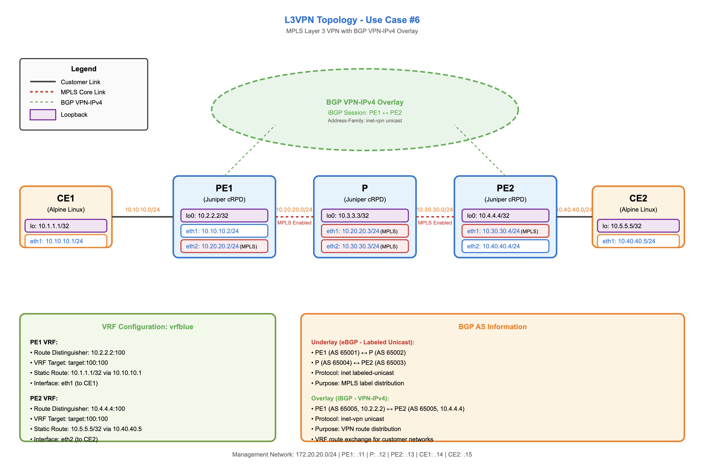

# Use Case #6 - L3VPN

## Quick Links
- [Intro](#intro)
- [Summary](#summary)
- [Steps](#steps)
- [Milestones](#milestones)
- [Outcomes](#outcomes)
- [What's next?](#whats-next)

## Intro

This use case demonstrates how an AI agent can be used to `troubleshoot` a connectivity failure in a configured L3VPN in our network.

### L3VPN

A Layer 3 VPN (`L3VPN`) is a virtual private network service that operates at the network layer (Layer 3) of the OSI model, using IP routing to connect multiple customer sites across a service provider's network.

#### How it works:

The service provider uses `MPLS` (Multiprotocol Label Switching) to create isolated routing instances for each customer. Each customer gets their own virtual routing table, so their traffic remains separate from other customers even though they're sharing the same physical infrastructure.

#### Key components:

- Customer Edge (CE) routers - Located at customer sites, these connect to the provider network (Alpine containers)
- Provider Edge (PE) routers - Service provider routers that interface with customer sites and maintain separate VRF (Virtual Routing and Forwarding) instances for each customer (cRPD containers)
- Provider (P) routers - Core routers that switch MPLS-labeled traffic between PE routers (cRPD container)

#### Topology



## Summary

After deploying a Container Lab topology (see above diagram) with cRPD routers and Alpine Linux customer edge devices, users identify a connectivity failure in a configured L3VPN service where CE1 cannot reach CE2. The AI agent performs systematic L3VPN troubleshooting, analyzing MPLS core LSP establishment, IGP routing, BGP session states, VRF route propagation, and next-hop resolution across PE and P routers. Through methodical diagnosis—while users monitor with continuous ping tests—the agent identifies root cause issues ultimately restoring end-to-end L3VPN connectivity between customer sites.

## Steps

This section outlines the sequential workflow for completing the use case, combining both `manual verification` steps and `AI-assisted automation prompts`. Each step is designed to build upon the previous one, creating a logical progression from initial environment setup through configuration, validation, and teardown.

- **Manual steps** allow you to observe and verify the AI agent's actions, ensuring transparency and providing learning opportunities to understand what's happening behind the scenes. A few recommendations are provided. Feel free to do them (execute commands, read docs, etc..).
    They are identified as **X. Manual -** (where X is the step number) inside this **Steps** section.
- **AI prompt steps** leverage Claude Desktop with MCP servers to automate complex network operations, demonstrating how natural language instructions can be translated into precise network configurations and operational commands. Copy/Paste the **whole prompt block** into Claude chat.
    They are identified as **X. Prompts -** (where X is the step number) inside this **Steps** section.

By following these steps in order, you'll experience a complete network automation workflow that balances human oversight with AI efficiency, giving you hands-on experience with modern network operations practices while maintaining full visibility and control over the process.

Feel free to test also with your own prompts (at your own risk ⚠️ ) so you can play, test and understand that prompts are one way of providing context to the AI agent and depending on what you write, the AI agent will act in a different way.

This is the list of suggested steps in use case #6:

📢 **Suggestion: Start a new chat for this use case!**

#### 1. Prompt - Deploy topology

> 1. Connect to the Linux VM and go to the directory named `/home/claude/workspace/uc6-l3vpn/`. This will be your `workspace` for this `use case #6 (L3VPN)`.
> 2. Deploy the container lab topology file (`uc6-l3vpn.clab.yml`). No `sudo` required.
> 3. Verify that the state of all the containers from that topology is `running`.
> 4. Do not do anything else.

This step corresponds to `milestone #1` 🚩.

#### 2. Manual - Connect to the topology routers

Connect directly to the topology routers (CE1, PE1, P, PE2 and CE2) to inspect and verify their configurations and operational state. 

Issue the following commands to verify the configuration on the routers (PE1, P and PE2):

- show configuration protocols bgp | display set
- show configuration policy-options | display set
- show configuration routing-instances | display set
- show configuration routing-options | display set
- show configuration interfaces | display set

Issue the following commands to verify the connectivity on the customers (CE1, and CE2):

- CE1 (sending 4 ping packets)

    ```bash
    claude@ce1:~$ ping -c 4 10.5.5.5
    PING 10.5.5.5 (10.5.5.5): 56 data bytes
    ^C
    --- 10.5.5.5 ping statistics ---
    4 packets transmitted, 0 packets received, 100% packet loss
    ```

- CE2 (sending 4 ping packets)

    ```bash
    claude@ce2:~$ ping -c 4 10.1.1.1
    PING 10.1.1.1 (10.1.1.1): 56 data bytes
    ^C
    --- 10.1.1.1 ping statistics ---
    4 packets transmitted, 0 packets received, 100% packet loss
    ```

⚠️ There is a connectivity issue ❌ (no ping between CEs). Feel free to leave the ping running (remove `-c 4`) while we ask our AI agent to troubleshoot the issue! 

This step corresponds to `milestone #2` 🚩.

#### 3. Prompt - New topology clarification

> In this use case, the topology nodes have a few different nodes (Linux Alpine and JunOS cRPD). It is reusing the IPs of other routers, however the list of routers you are getting from the tool `get router list` is not exactly as in this use case. Here it is the mapping:
>    - pe1 -> pe1
>    - pe2 -> pe2
>    - pe3 -> p
>    - pe4 -> ce1
>    - pe5 -> ce2
>    - pe6 (not being used!)

This step corresponds to `milestone #3` 🚩.

#### 4. Prompt - Troubleshooting

> This topology has a L3VPN service configured, but it is not working. Why? Help me troubleshoot it!

This step corresponds to `milestone #4` 🚩.

#### 5. Manual - Reconnect to the topology routers

If you disconnected from step #2, connect again to the routers (CE1, PE1, P, PE2 and CE2) to inspect and verify what `claude` user is doing to fix the connectivity between CE1 and CE2. 

Connect to PE1, P and PE2 and monitor what the AI agent is doing. Issue any of these command to trace it:

```
monitor start messages | grep claude
```
or 
```bash
claude@pe1> start shell
% tail -f /var/log/messages | grep claude
```

⚠️ Remember there was a connectivity issue ❌ (no ping between CEs). Feel free to leave a ping running (remove `-c 4`) while we ask our AI agent to troubleshoot the issue! 

- CE1

    ```bash
    claude@ce1:~$ ping 10.5.5.5
    PING 10.5.5.5 (10.5.5.5): 56 data bytes
    ```

- CE2

    ```bash
    claude@ce2:~$ ping 10.1.1.1
    PING 10.1.1.1 (10.1.1.1): 56 data bytes
    ```

This step corresponds to `milestones #5 and #6` 🚩.

#### 6. Prompt - Issue a report about the incident

> Generate a comprehensive network troubleshooting report for the L3VPN issue we just resolved. The report should include:
>    - Executive summary suitable for management
>    - Detailed technical analysis with command outputs
>    - Root cause analysis explaining the "why" behind the failure
>    - Step-by-step troubleshooting methodology followed
>    - Configuration changes made (with before/after comparison)
>    - Verification results showing the fix worked
>    - MPLS label stack analysis explaining the forwarding behavior
>    - Lessons learned and best practices
>    - Prevention strategies and monitoring recommendations
>    - Complete configuration snippets in an appendix

This step corresponds to `milestone #7` 🚩.

#### 7. Prompt - Destroy the topology

1. 💡tip: This is the end of this use case. Do not destroy the topology if you still want to play a bit until the rest of the people finishes or proctors move the the next one.
2. 💡tip: If you feel confortable with ContainerLab and linux, you can **save some tokens** by destroying the topology yourself through the CLI issuing the following commands:

```bash
claude@jcl-ws-vm-01:~ $ gousecase6
claude@jcl-ws-vm-01:~/workspace/uc6-l3vpn (main)$ 

claude@jcl-ws-vm-01:~/workspace/uc6-l3vpn (main)$ clab destroy -c
11:02:43 INFO Parsing & checking topology file...
11:02:43 INFO Destroying lab name...
11:02:47 INFO Removed container name...
11:02:47 INFO Removing host entries path=/etc/hosts
11:02:47 INFO Removing SSH configs...
claude@jcl-ws-vm-01:~/workspace/uc6-l3vpn (main)$ 
```

else, ask the AI agent to do it for you with this prompt:

> 1. Destroy the container lab topology from `use case #6 (L3VPN)` workspace and clean up the environment.
> 2. Do not add any environment cleanup summary.

This step corresponds to `milestone #8` 🚩.

---

📢 **Suggestion: Rename this chat in Claude Desktop App to `UC6 - L3VPN`!**

---

## Milestones

These are the milestones accomplished in this use case (either manually or by prompting the AI agent):

1. 🚩 Prompt - Ask our AI agent to connect to the Linux server and deploy a Container Lab topology (Linux MCP).
2. 🚩 Manual - Connect to the network of cRPD devices.
3. 🚩 Prompt - Let our AI agent know we are reusing the IPs in this use case to ease things basically.
4. 🚩 Prompt - Ask our AI agent to help us troubleshoot an issue with a L3VPN configured in the topology. There is no connectivity from CE1 to CE2.
5. 🚩 Manual - We monitor what our AI agent is doing.
6. 🚩 Manual - We check the status of the connectivity with an continous `ping` command and let it work while we see what it is doing and its reasoning.
7. 🚩 Prompt - Ask the AI agent to issue a report about the incident and the fix.
8. 🚩 Prompt or Manual - Destroy the containerlab topology and clean up the environment.

---

## Outcomes

//TODO

## What's next?

//TODO

